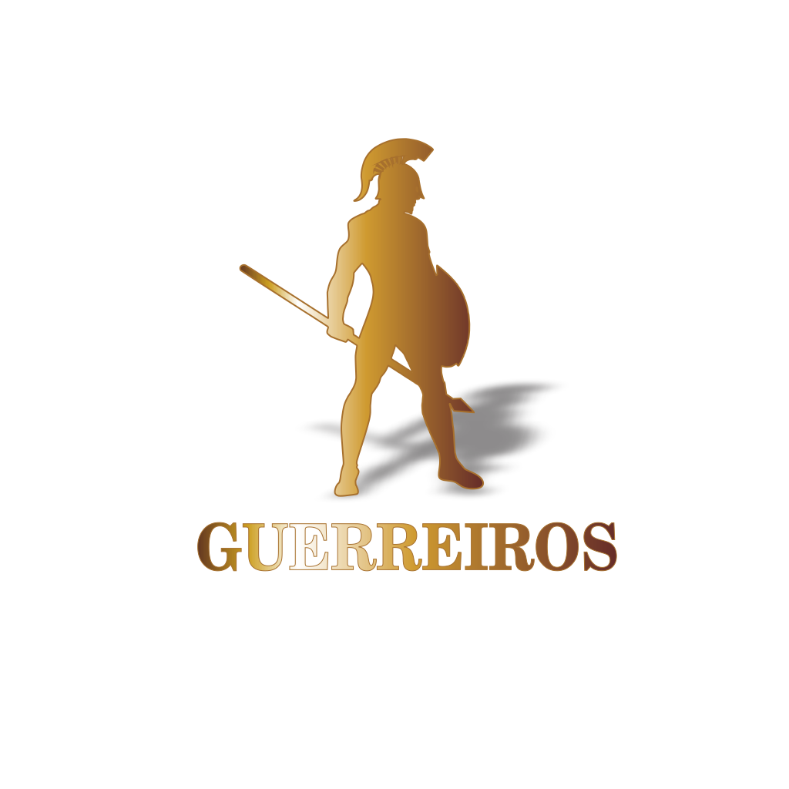

# real-time-game-mobile
<h1 align="center">
  
</h1>

  <a href="#-tecnologias">Tecnologias</a>&nbsp;&nbsp;&nbsp;|&nbsp;&nbsp;&nbsp;
  <a href="#-projeto">Projeto</a>&nbsp;&nbsp;&nbsp;|&nbsp;&nbsp;&nbsp;
  <a href="#-layout">Layout</a>&nbsp;&nbsp;&nbsp;|&nbsp;&nbsp;&nbsp;
  <a href="#memo-licença">Licença</a>

 

  

 

## 🚀 Tecnologias

- React Native
- TypeScript
- Expo

## 💻 Projeto

real-time-gamer-mobile real-time-game é uma sistema para um time amador poder transmitir jogos, divulgar patrocinadores e mostrar tudo relacionado ao time

